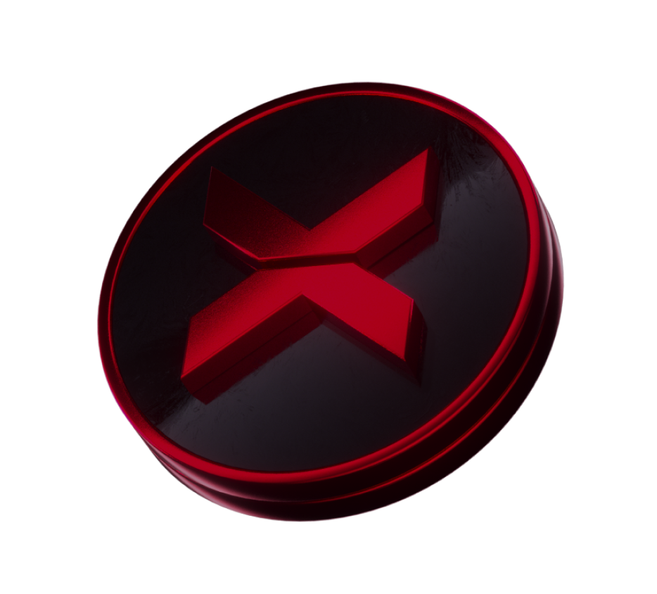

# Shpërblimet

<figure><figcaption>
Ky është $XBG ynë i dashur. Bileta juaj për avantazhet e mahnitshme të lojërave.
</figcaption></figure>

Cilës shpërblim do të marr?

Bazuar në pikët tuaja dhe objektivat kolektive të arritura, do të merrni një shpërblim individual në tokenë $XBG, si dhe një shpërblim kolektiv në tokenë $XBG. Të gjitha shpërblimet janë [të mbyllura](rewards-test.md#sa kohë janë të mbyllura shpërblimet).

Sa kohë janë të mbyllura shpërblimet?

Si do të marr shpërblimin tim?

Pas përfundimit të kualifikuesit ose sezonit, shpërblimet do t'i dërgohen xhepit që keni dhënë, bazuar në renditjen tuaj përfundimtare pas përfundimit të konkursit. Shenim: Të gjitha shpërblimet janë [të mbyllura](rewards-test.md#sa kohë janë të mbyllura shpërblimet).

Ku mund të jap xhepin tim?

Pse po marr një shpërblim?

Ju shpërblejmë në shenjë mirënjohje për pjesëmarrjen dhe kontributin tuaj aktive në zgjerimin e komunitetit XBorg dhe për promovimin e tokenit tonë $XBG.

Cili është një shpërblim kolektiv?

Një shpërblim kolektiv është një tregim i mirënjohjes sonë për përpjekjen kolektive të pjesëmarrësve, ku shpërblimet përmirësohen duke arritur nivele të mëdha gjatë sezonit. Sipas renditjes tuaj në fund të sezonit, do të merrni një shpërblim shtesë nga fondi kolektiv.

Si do të ndahet shpërblimi kolektiv? Çfarë mund të bëj për ta rritur atë?

Ndarja e shpërblimit kolektiv përcaktohet nga renditja juaj dhe mund të përmirësohet kolektivisht duke arritur objektivat kolektive ose duke plotësuar veprime të shpejta. Për më shumë informacion, ju lutemi referohuni te [rregullat](rules-test.md).

Çfarë mund të bëj për të rritur shpërblimin tim?

Mënyra më e mirë për të maksimizuar shpërblimin tuaj është përmes konsistencës së kombinuar me viralitetin. Sa më të gjerë të jetë ndikimi juaj, aq më lart do të ngjiteni në tabelën e rezultateve.

Çfarë janë shpërblimet për fazën e parë të kualifikimit?

Në fazën e parë të kualifikimit, shuma totale e shpërblimeve arrin në maksimumin e 100k XBG, me një pjesë të lidhur me arritjen e objektivave kolektive.

Cili është zona e shpërblimit?

