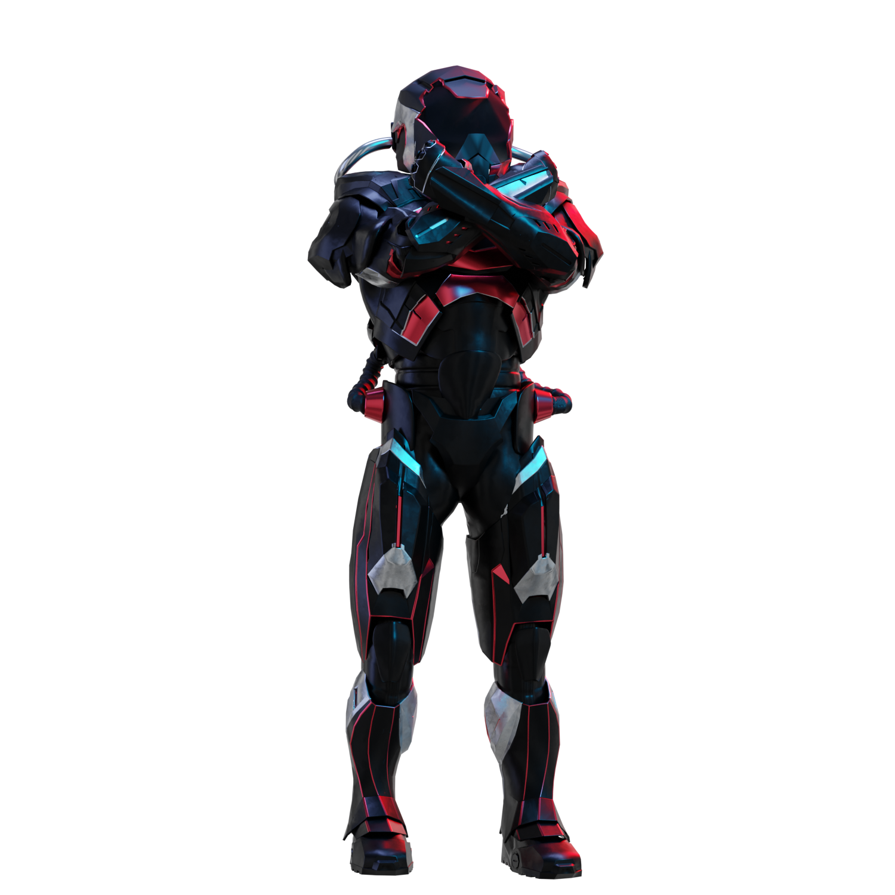

# القواعد

<figure><figcaption></figcaption></figure>

ما هي القواعد؟

يرجى [التمرير لأسفل](rules-test.md#rules). يرجى ملاحظة أنها تكمل بشروط وأحكام يوافق عليها كل مشارك.

هل يمكنني تخصيص ملفي الشخصي أو الصورة الرمزية خلال التحدي؟

تخصيص ملفك الشخصي أو الصورة الرمزية على XBorg.gg أو Twitter خلال اللعبة لا يؤثر على البيانات المجمعة عبر LunarCrush. البيانات مرتبطة بمقبض Twitter الخاص بك وليس بصورة ملفك الشخصي.

هل يمكنني التعاون مع مؤثرين آخرين للحصول على فوائد متبادلة؟

بالتأكيد، يمكن أن تعزز التعاونات مع مؤثرين آخرين مشاركة تغريداتك بشكل كبير وتعزيز رؤية مشروعنا. طالما أن هذه التعاونات تلتزم بالإرشادات، فهي مشجعة.

كم عدد المتابعين الذي يجب أن يكون لدي للمشاركة؟

التحدي مفتوح للجميع، ولكن سيتم احتساب نقاطك فقط إذا كان لديك 500 متابع على Twitter على الأقل.

ما الذي يجب تجنبه عند كتابة تغريدة؟

يتم اعتبار عدة عوامل لتحديد البريد المزعج: الكلمات المتكررة، والوسوم غير ذات الصلة، والمصطلحات المحظورة مثل "الهدايا" و "التوزيعات الجوائز" و "السحوبات". لمزيد من المعلومات، قم بزيارة: [https://lunarcrush.com/faq/how-does-lunarcrush-recognize-spam](https://lunarcrush.com/faq/how-does-lunarcrush-recognize-spam)

هل يمكنني تشكيل فرق أو تحالفات مع مؤثرين آخرين؟

بالتأكيد، يمكن أن تعزز التعاونات مع مؤثرين آخرين مشاركة تغريداتك بشكل كبير وتعزيز رؤية مشروعنا. طالما أن هذه التعاونات تلتزم بالإرشادات، فهي مشجعة.

هل هناك عواقب للأفعال التي تنتهك إرشادات اللعبة؟

تحتوي LunarCrush على أنظمة آلية لاكتشاف أنواع مختلفة من السلوكيات الغير لائقة. عند الكشف عنها، لن تعترف بك LunarCrush بعد الآن كمؤثر، مما يؤدي إلى توقف تراكم النقاط. إذا لزم الأمر، قد تواجه أيضًا إلغاء التأهل من المسابقة، مما يعني فقدان الأهلية للمطالبة بالمكافآت.

## **القواعد**

> **تحدي XBorg**

**مقدمة:** كن أكثر المؤثرين المشاركين والمؤثرين في XBorg X للفوز برموز XBG!&#x20;

**الفكرة:** \
يتم تتبع أفضل 300 حساب يظهرون أعلى مستوى من المشاركة في المحتوى الذي يحتوي على وسوم #XBORG أو #XBG أو $XBG يوميًا. بناءً على أدائهم اليومي، يتراكم لديهم نقاط مرئية على لوحة المتصدرين لدينا. في نهاية الموسم، سيتلقى اللاعبون مكافآتهم بناءً على ترتيبهم.&#x20;

**معايير التسجيل:** \
يمكن لحسابات Twitter فقط التي لديها أكثر من 500 متابع تراكم النقاط. بالتعاون مع LunarCrush، نحلل ونرتب التغريدات التي تحتوي على وسوم #XBG أو #XBorg أو $XBG. يضمن نظامهم سلامة المسابقة مع حماية ضد البريد المزعج والغش. لفهم معاييرهم، يرجى الرجوع إلى الأسئلة المتكررة في LunarCrush. بناءً على التصنيف الخاص بـ LunarCrush، يتم منح النقاط يوميًا وفقًا لجدولنا التفصيلي \[الجدول 1]. يمكن العثور على التصنيفات المجمعة على {XBorg.com}.&#x20;

**المكافآت:** \
تم تخصيص ميزانية قدرها 100 ألف دولار XBG لهذا الموسم الافتتاحي، تنقسم بين المكافآت الفردية (33٪) والمكافآت الجماعية (66٪). تحقيق الأهداف الجماعية يفتح المكافآت الجماعية للجميع. سيشارك أعضاء في منطقة المكافآت في نهاية التحدي في المكافآت بناءً على الجدول \[الجدول 2]. سيتم إرسال رموز XBG بعد حدث إنشاء الرموز (TGE) وسيتم قفلها في البداية لمدة شهر وسيتم تخصيصها على مدار ستة أشهر. هناك أيضًا مكافآت مفاجئة في انتظارك وسيتم منحها بناءً على تقدير XBorg.&#x20;

**قواعد اللعب النزيهة:** \
نقدر الإبداع والأصالة والأخلاق. لقد أنشأنا أدوات وإجراءات لتحديد السلوك غير الملائم. سيتم تحديد المحتالين ومستخدمي الروبوتات وإقصائهم. قرارات XBorg نهائية.&#x20;

**إخلاء المسؤولية:** \
يجب على كل مشارك قراءة وقبول الشروط والأحكام للمشاركة في تحدي XBorg. لا يتحمل XBorg مسؤولية الأفعال أو الإغفال أو المشاكل التقنية أو انهيارات الخادم أو الأخطاء أو انقطاع الخدمة أو الحذف أو العيوب أو تأخيرات النقل أو السرقات أو التدمير أو الوصول غير المصرح به أو التعديلات المتعلقة بأطراف ثالثة مثل LunarCrush أو X أو أي حدث غير متوقع قد يعطل وظيفة التحدي.&#x20;

**حقوق التعديل:** \
نحتفظ بالحق في تغيير شروط وأحكام التحدي بحسب تقديرنا. على الرغم من أننا قد نفعل ذلك دون إشعار مسبق، إلا أننا سنسعى دائمًا للتواصل أي تغييرات كبيرة للمشاركين في أقرب وقت ممكن.&#x20;

**تحديد المسؤولية:** \
من خلال المشاركة في هذا التحدي، فإنك توافق على إخلاء XBorg من أي مسؤولية تتعلق بالخسارة أو الضرر أو الإصابة الناتجة مباشرة أو غير مباشرة من مشاركتك، بما في ذلك ولكن لا يقتصر على الأضرار الناجمة عن الفيروسات الحاسوبية أو العناصر الخبيثة الأخرى المحصلة من استخدام موقع التحدي أو أي موقع آخر مرتبط به.