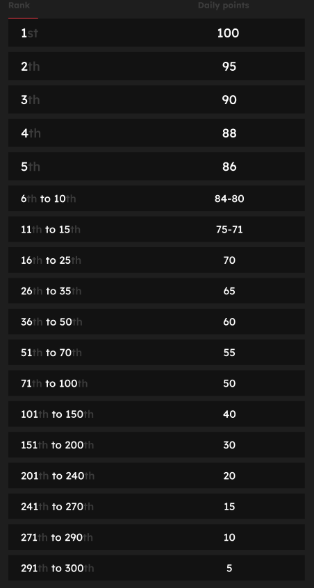

# 排行榜

<figure><figcaption>
这可能是你... 👀
</figcaption></figure>

我发了一条推文，为什么我的积分没有更新？

我们每24小时刷新一次数据，所以你的分数会相应地更新。请记住，一条推文首先需要有一定数量的参与度（浏览量、点赞、评论、转发）才能被[LunarCrush](lunarcrush-test.md)计算。这可能导致最多延迟48小时。值得注意的是，你每天可以发推文的数量没有限制。当频繁而一致地发推文时，LunarCrush的处理延迟对你的影响较小。

为了获得最多积分，我需要做什么？

为了在赛季中获得最高积分，目标是每天在排名中争取最高位置。始终位于前300名参与者之间是一个坚实的基础，但获得显著的排名是确保最大积分的成就。

保持定期出现是至关重要的，以避免错过每日积分。为了进一步优化你的每日积分，考虑以下最佳实践：

利用[LunarCrush](lunarcrush-test.md)的影响力评分。保持一致的发布计划（对于顶级影响者，每天发布10-40次）。使用准确的$标记和#标签（#XBorg，$XBG和#XBG）。提供有价值的内容来吸引你的关注者。与相关的帖子互动，特别是与你热衷的代币、交易所或NFT相关的帖子。通过使用高质量的视觉效果来优化视觉吸引力。标记其他有影响力的个人和与你关注的代币相关的知名人物。避免过度使用无关的标签以防止垃圾信息。

一条推文、点赞、评论和转发可以获得多少积分？

由于我们依赖[LunarCrush](lunarcrush-test.md)，我们不为单独的行为分配积分。LunarCrush通过衡量你在XBorg项目中的整体参与度来生成排名。根据每日排名，玩家积累积分。有关影响力排名如何生成的更多详细信息，请参阅[LunarCrush的常见问题解答](https://lunarcrush.com/faq/how-does-lunarcrush-calculate-social-influence)。

根据我的影响力，积分是如何奖励的？

综合参与度活动，包括推文、点赞、转发、评论和关注者等行为，对于确定你每天的影响力排名起到一定作用，这是由LunarCrush测量的。XBorg根据这个排名每天分配积分。在阶段结束时获得更高的排名将获得更丰厚的奖励。

如何查看我的积分和每日排名？

访问<mark style="color:red;">**{链接到排行榜}**</mark>，排名每24小时更新一次。

每日排名是如何工作的？

根据过去24小时由LunarCrush计算和测量的排名，你每天获得积分。

积分奖励如下：

如果你的排名超过300名，那天你将不会获得积分。但这就是这个排名的优势：每天你都有新的机会表现。

我们希望这个分解能清楚地解释积分如何累积。

积分和排名多频繁更新？

我们每天进行数据提取，并将积分分配给当天排名前300的影响者。因此，排行榜每24小时更改一次。

排行榜是如何更新的？

每天，你根据你的每日排名获得积分。这些积分每天累积，编制排行榜。这个排行榜在决赛或赛季结束时决定你的奖励。

