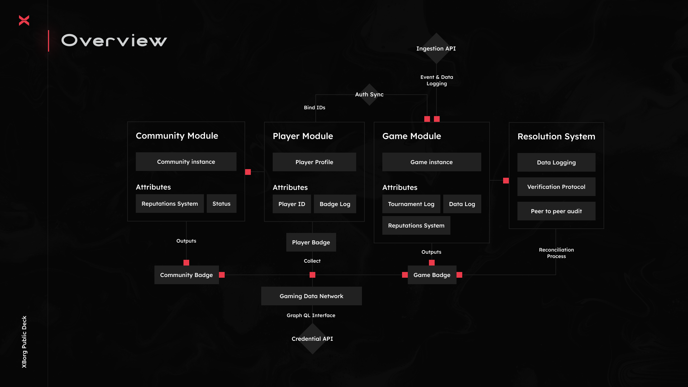

# Gaming Credential Network

> Voordat je de volgende vragen verkent, bekijk de presentatie van het Gaming Credential Network:[#wat-is-een-gaming-credential-network](gaming-credential-network.md#what-is-a-gaming-credential-network "vermelding") 😎

Waarom een Gaming Credential Network opbouwen?

In de hedendaagse maatschappij, waar vrije tijd steeds overvloediger wordt, brengen spelers talloze uren door in de wereld van games. Toch wordt de data die uit deze ervaringen voortkomt vaak ondergewaardeerd en gefragmenteerd over meerdere spellen. XBorg erkent de waarde van de tijd van spelers en streeft ernaar hun data betekenisvol en waardevol te maken. Denk hierbij aan een gaming [**Decentralized Identifier (DID)**](https://www.w3.org/TR/did-core/) systeem.\
\
Bovendien maakt het Gaming Credential Network de creatie van betere gaming applicaties en interoperabiliteit gekoppeld aan de identiteit van spelers mogelijk.

Wat zijn de voordelen voor spelers?

* Spelers bezitten en centraliseren hun gaming data op één plek
* Spelers krijgen toegang tot gaming applicaties en hulpmiddelen binnen het ecosysteem
* Spelers kunnen hun data gelde maken

Wat zijn de voordelen voor ontwikkelaars?

* Ontwikkelaars kunnen aangepaste spelerservaringen ontwikkelen
* Bedrijven kunnen gebruikers werven door spelers te targeten tegen betaling
* Het Gaming Credential Network biedt directe toegang tot spellen en ontwikkelaars, waardoor hun bereik wordt uitgebreid
* Ontwikkelaars kunnen toegang krijgen tot meer gedetailleerde data, wat de nauwkeurigheid van matchmaking en andere app-functies verbetert
* Het platform maakt nieuwe gebruiksscenario's voor applicaties mogelijk, inclusief reputatiegebaseerd lenen

Hoe ziet een speler-ID eruit?

Het speler-ID is een Soulbound token die een aggregatie vertegenwoordigt van alle Soulbound tokens verkregen door de gebruiker. Het speler-ID omvat ook Soulbound tokens buiten het XBorg ecosysteem zoals het Lens protocol.

Kunnen ontwikkelaars nu al beginnen met het bouwen van applicaties bovenop het credential netwerk?

Momenteel is het Gaming Credential Network gecentraliseerd. Zodra het netwerk gedecentraliseerd is, kunnen ontwikkelaars erop bouwen.

Hoe schaal je het Gaming Credential Network op?

De gaming- en community engagement-app is de hoofdtoepassing die ons in staat stelt het Gaming Credential Network op te schalen.

Hoe wordt data privacy behandeld?

Toekomstige iteraties van het protocol zullen spelers in staat stellen om relevante datapunten selectief te onthullen door opt-in/opt-out functionaliteit mogelijk te maken. Bovendien zullen zero-knowledge technologieën worden opgenomen in latere updates, wat de onwrikbare toewijding van het platform aan privacy en gegevensbeveiliging benadrukt.

Wat zijn de modules van het Credential Network?

* Community
* Speler
* Spel

#### 

Is het Gaming Credential Network on-chain?

Op dit moment wordt het Gaming Credential Network veilig off-chain opgeslagen. Echter, naarmate het ecosysteem groeit en de gebruikersbasis de drempel van 100.000 overschrijdt, zal het netwerk naadloos overgaan op de blockchain, wat de standvastige toewijding van XBorg aan toegankelijkheid en transparantie onderstreept.

Is de ontwikkelaarsdocumentatie of SDK al klaar?

Het is momenteel in ontwikkeling, maar zal waarschijnlijk pas tegen het einde van de zomer van 2024 worden uitgebracht.

Op welke blockchain zal het Credential Network worden gebouwd?

In eerste instantie op Polygon en andere L2's. Naarmate het netwerk populairder wordt, zal het zijn eigen L2/L3 worden, bekend als de Borg chain.

Wat zijn de beperkingen van het Gaming Credential Network?

* **Sybil-weerstand:** Een inherente beperking van de netwerkinfrastructuur ligt in de vatbaarheid van zijn gebruikers om valse persona's aan te nemen of geavanceerde technologieën zoals kunstmatige intelligentie te gebruiken om hun digitale identiteiten te manipuleren. Om de schadelijke effecten van Sybil-aanvallen te beperken, omvat een effectieve strategie de integratie van een bewijs van identiteit mechanisme in het onderliggende protocol van het netwerk.

<!---->

* **Schaal**: De ware waardepropositie van het credential netwerk is afhankelijk van het bereiken van een vereist niveau van netwerkschaal, een prioriteit die momenteel van groot strategisch belang is voor XBorg. Echter, eenmaal dit doel is gerealiseerd, zijn de potentiële toepassingen die uit het netwerk kunnen worden gehaald werkelijk grenzeloos.

