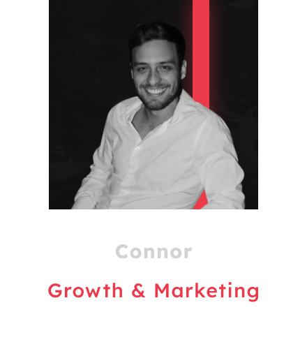

# Ontmoet het Team

> XBorg is een gaming protocol dat de entertainmentwereld opnieuw wil definiëren via Web3 en Web2. Het pionieren in deze ruimte zou niet mogelijk zijn zonder een toegewijd team, waarvan de gezichten hieronder worden getoond.

## Wie zit er in het team achter XBorg en welke ervaring hebben ze?

Het team achter XBorg bestaat uit 12 leden, die elk hun expertise meebrengen naar XBorg.

|   |   |
|---|---|
| .png) | Voorafgaand aan de oprichting van XBorg heeft hij bijgedragen aan bekende DAO's (CityDAO, MakerDAO) en heeft hij relevante ervaring in de traditionele financiële sector en kwantitatieve analyse bij Rothschild & Co en Credit Suisse. Louis heeft het grootste deel van zijn jeugd besteed aan het spelen van Call Of Duty en is nog steeds een actieve FPS-speler. Bij XBorg heeft hij in zijn eentje het gaming paspoort alpha ontwikkeld en leidde hij de uitvoering van de routekaart, strategie en fondsenwerving. |
| .png) | Met meer dan 14 jaar ervaring in softwareontwikkeling trad ze toe tot SwissBorg als Senior Software Engineer om een infrastructuur te bouwen die nu wordt gebruikt door meer dan 700.000 gebruikers voordat ze bij XBorg kwam om het technische team te leiden. In haar vrije tijd is Laureline een fervent gamer, die regelmatig leiding geeft aan raids met meer dan 30 spelers in Final Fantasy, of heerst over Minecraft-servers als geen ander. |
| .png) | Met een schat aan ervaring in de industrie heeft Arthur gewerkt aan uiteenlopende projecten, waaronder persoonlijke websites, e-commerce platforms en banktoepassingen. In zijn vrije tijd geniet Arthur van gamen, vooral strategie- en racespellen. Hij vindt dat het strategisch denken dat in deze spellen vereist is, goed overeenkomt met zijn werk als software engineer, waar hij uitblinkt in het vinden van creatieve oplossingen voor complexe problemen. |
| .png) | Backend ontwikkelaar bij XBorg die gespecialiseerd is in het bouwen van schaalbare webapplicaties en voor XBorg verschillende e-commerce applicaties heeft ontwikkeld en aan een bankapplicatie heeft gewerkt. In zijn vrije tijd speelt hij graag indie- of MMORPG's en als er een achievementsysteem is, zal hij zeker gaan voor 100% voltooiing van die prestaties. |
| .png) | Na drie jaar ondernemerschap trad Gauthier toe tot PrimeDAO om nieuwe modellen voor start-up incubatie te ontwerpen. Aanvankelijk een gemeenschapslid, werd hij aangetrokken door de visie van XBorg en sloot zich aan bij het project. Gauthier ondersteunt nu de verschillende teams en lopende projecten om ervoor te zorgen dat XBorg de juiste koers vaart. Met een diepgaand begrip van de gamingindustrie, urenlang in-game leiding geven aan guilds en ervaring in snelgroeiende start-ups, brengt Gauthier zijn jack-of-all-trades benadering naar het team. |
| .png) | Een veelzijdige ontwerper, kunstenaar en muzikant met tien jaar ervaring. Voordat hij bij XBorg kwam, lanceerde hij een kledingmerk, werkte hij zeven jaar als merkontwerper en evolueerde hij vervolgens naar productontwerper. Levensmissie - mensen helpen bij het bouwen van impactvolle producten die bijdragen aan de groei en evolutie van de wereld. Als design lead bij XBorg is hij een ware creatieve kracht die innovatieve en visueel verbluffende ontwerpen maakt. Hij heeft XBorg volledig opnieuw gebrand om eruit te zien als de beste gamingmerken en het bedrijf naar een hoger niveau getild. |
| .png) | Hij maakt gebruik van zijn 15 jaar ervaring in de financiële sector (beleggingsadviseur en private banker) bij Société Générale om educatieve crypto-content te creëren. Hij is ook voormalig merkambassadeur en DAO-lid van SwissBorg. Hij is een fervent speler van managementgames zoals Civilization en EuroGames-stijl bordspellen. Als ITO Project Manager bij XBorg draagt hij bij aan het creëren van duurzame omgevingen voor esports-teams om hun fans te betrekken en te behouden. |
|  | Connor Kirsten leidt Growth en Marketing bij XBorg. Voorheen een actief lid van de Afrikaanse startupscene en bedreven in business development, marketing en growth-hacking, heeft Connor een digitale activa-uitwisseling en een online locatieboekingsplatform opgericht voordat hij bij XBorg kwam. Sindsdien heeft hij de Prometheus NFT-verkoop geleid, het Xtreme Championship Series georganiseerd en het sociale volgen van XBorg met 100x vergroot. Connor besteedt zijn vrije tijd aan het spelen van Rocket League, Call of Duty en God of War. |
| .png) | De Investment and Advisory lead bij XBorg, met een geschiedenis van sociale en financiële analyses. Hij leidt de lancering en is medeauteur van de Whitepaper V1, terwijl hij de adviesafdeling "XBorg ventures" en de contentafdeling van de organisatie heeft ontwikkeld. Daarnaast streeft Sam er met +20.000 speeltijd naar om de toekomst van gaming te pionieren en de kloof tussen Web2 en Web3 te overbruggen. |
| .png) | Esports lead voor XBorg, voormalig Counter-Strike Pro, Business developer voor CS Manager. Ervaren in blockchain- en gamingprojecten: Business developer voor Vanilla Network; Community Manager voor SinVerse. Bij XBorg heeft hij in zijn eentje het beste web3 esports-team opgebouwd, met meer dan 70 toernooien gewonnen en meer dan 60.000 dollar aan prijzengeld. |
| .png) | Hoofd community bij XBorg, ik ben een echte avonturier in hart en nieren, met een passie voor gaming, gemeenschapsleven en het verkennen van nieuwe horizonten. Met meer dan 10 jaar ervaring in vliegtestontwerp heb ik mijn analytische vaardigheden en probleemoplossend vermogen verfijnd. Maar het zijn mijn reizen over de hele wereld, inclusief een speciale stop in Brazilië, die echt mijn kijk op het leven hebben gevormd en mijn verlangen hebben gewekt om nieuwe paradigma's te creëren in community building. Als fervent speler ben ik voortdurend op zoek naar nieuwe uitdagingen en manieren om mijn grenzen te verleggen, zowel in gaming als in het leven. |
| .png) | Ontwerper en redacteur bij XBorg. Voordat hij bij Xborg kwam, creëerde hij 3D/video's en werkte hij voor bekende esports-organisaties zoals FNATIC, NRG, Heretics, T1, Shopify en meer. Sean is altijd een actieve gamer geweest sinds zijn kindertijd, waarbij zijn dominante categorie competitieve FPS-games zoals COD, CSGO, Valorant en Apex zijn, waarin hij in de meeste gevallen tot de top 1% behoort. Sinds hij bij XBorg is gekomen, heeft hij verschillende inhoud gemaakt, zoals 3D-werk, aankondigingsvideo's en motion graphics, terwijl hij probeert bij te dragen aan de exponentiële groei van XBorg. |

## Andere relevante vragen over het team

Wat is de omvang van het team?

Er zijn momenteel **12 fulltime medewerkers**.

Wie werkt er fulltime en wie parttime?

**Alle** teamleden werken fulltime.

Wat zijn de belangrijkste competenties van de belangrijkste teamleden?

Ons team heeft een diverse vaardighedenset, maar we delen allemaal een passie voor gaming en esports. Onze vaardigheden variëren van software engineering en smart contract ontwikkeling tot business development, product design en community management.

Zijn jullie aan het werven? Waar kan ik vacatures vinden?

Ja, we zijn op zoek naar software engineers, ontwerpers en productmanagers. De functies zijn hier te vinden:&#x20;

[https://jobs.lever.co/swissborg?department=XBorg](https://jobs.lever.co/swissborg?department=XBorg)

