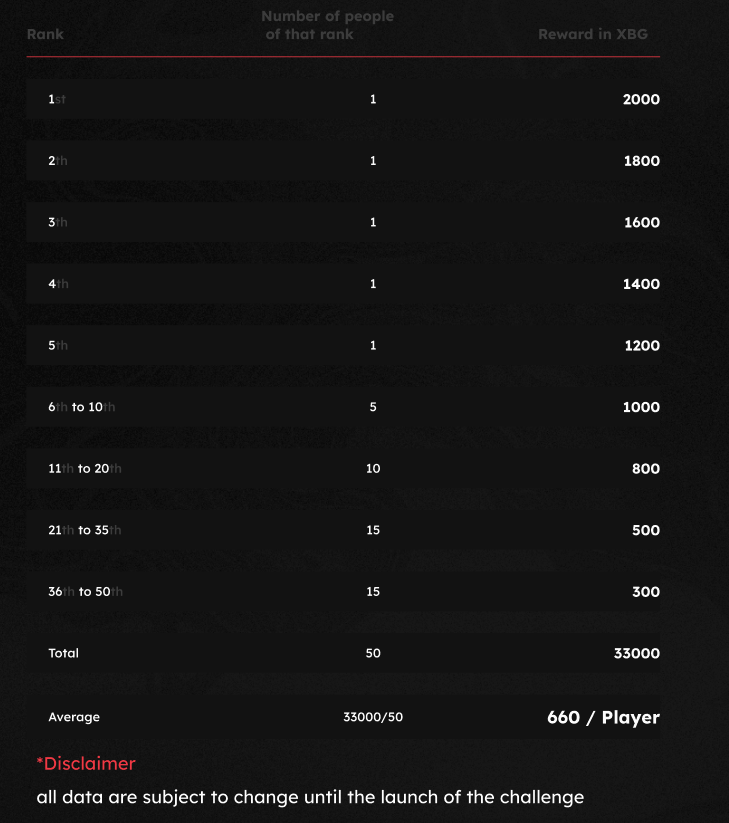

# Beloningen

<figure><figcaption>
Dit is onze geliefde $XBG. Jouw ticket naar verbluffende gaming-voordelen.
</figcaption></figure>

Welke beloning krijg ik?

Op basis van je puntentotaal en de behaalde collectieve doelen, ontvang je een individuele beloning in $XBG-tokens, evenals een collectieve beloning in $XBG-tokens. Alle beloningen zijn [vastgezet](rewards-test.md#hoe-lang-zijn-beloningen-vastgezet).

Hoe lang zijn beloningen vastgezet?

Hoe krijg ik mijn beloning?

Aan het einde van de kwalificatieronde of het seizoen worden de beloningen naar de door jou opgegeven portemonnee gestuurd, op basis van je uiteindelijke rangschikking nadat de wedstrijd is afgelopen. Let op: alle beloningen zijn [vastgezet](rewards-test.md#hoe-lang-zijn-beloningen-vastgezet).

Waar kan ik mijn portemonnee opgeven?

Waarom krijg ik een beloning?

We belonen je als blijk van waardering voor je actieve deelname en bijdrage aan de groei van de XBorg-gemeenschap en voor het promoten van onze $XBG-token.

Wat is een collectieve beloning?

Een collectieve beloning is een blijk van waardering voor de gezamenlijke inspanning van de deelnemers, waarbij beloningen worden verhoogd bij het behalen van mijlpaalniveaus tijdens het seizoen. Afhankelijk van je eindrangschikking ontvang je een extra beloning uit de collectieve pool.

Hoe wordt de collectieve beloning verdeeld? Wat kan ik doen om deze te verhogen?

De verdeling van de collectieve beloning wordt bepaald door je rangschikking en kan gezamenlijk worden verhoogd door het behalen van collectieve mijlpalen of het voltooien van flitsacties. Voor meer informatie, raadpleeg de [regels](rules-test.md).

Wat kan ik doen om mijn beloning te verhogen?

De beste manier om je beloning te maximaliseren is door consistentie te combineren met viraliteit. Hoe groter je bereik, hoe hoger je stijgt op de ranglijst.

Wat zijn de beloningen voor de eerste kwalificatiefase?

In de eerste kwalificatiefase bedragen de totale beloningen maximaal 100k XBG, waarvan een deel gekoppeld is aan het succesvol behalen van collectieve doelen.

Wat is de beloningszone?

