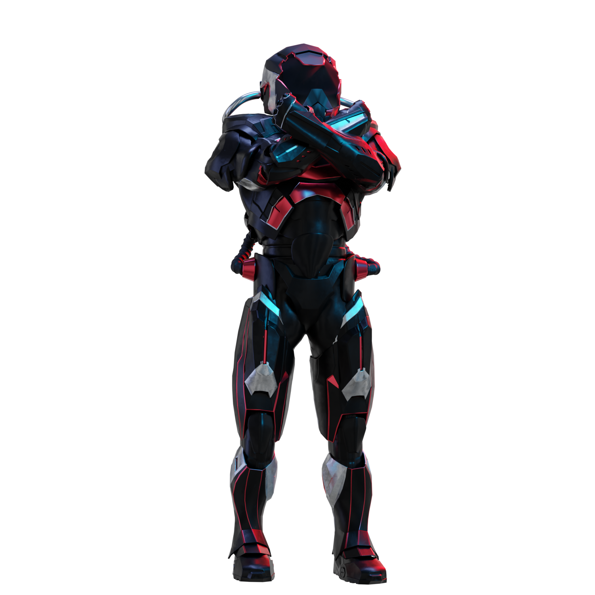

# Regels

<figure><figcaption></figcaption></figure>

## **REGELS**

> **De XBorg Uitdaging**

**Inleiding:** Word de meest betrokken en invloedrijke XBorg X-influencer om XBG-tokens te winnen!&#x20;

**Concept:** \
Elke dag worden de top 300 accounts met de hoogste betrokkenheid bij inhoud met de hashtags #XBORG, #XBG of $XBG gevolgd. Op basis van hun dagelijkse prestaties verzamelen ze punten die zichtbaar zijn op onze ranglijst. Aan het einde van het seizoen ontvangen spelers hun beloningen op basis van hun rangschikking.&#x20;

**Beoordelingscriteria:** \
Alleen Twitter-accounts met meer dan 500 volgers kunnen punten verzamelen. Samen met LunarCrush analyseren en rangschikken we tweets met de hashtags #XBG, #XBorg of $XBG. Hun systeem zorgt voor integriteit van de wedstrijd met bescherming tegen spam en valsspelen. Voor meer informatie over hun criteria, raadpleeg de LunarCrush FAQ. Op basis van de ranglijst van LunarCrush worden dagelijks punten toegekend volgens onze gedetailleerde [schaal](scoring/leaderboard.md#how-does-the-daily-ranking-work). De geconsolideerde ranglijsten zijn te vinden [hier](https://xbg-challenge.xborg.com/).&#x20;

**Beloningen:** \
Er is een budget van 100k $XBG toegewezen voor dit inaugurele seizoen, verdeeld tussen individuele (33%) en collectieve beloningen (66%). Het behalen van collectieve doelen ontgrendelt collectieve beloningen voor iedereen. Leden in de Beloningszone aan het einde van de uitdaging delen beloningen op basis van de schaal \[Tabel 2]. De XBG-tokens worden na het TGE (Token Generation Event) verzonden en worden aanvankelijk voor één maand vergrendeld en vervolgens over zes maanden uitgegeven. Er zijn ook verrassingsbeloningen beschikbaar en deze worden naar goeddunken van XBorg uitgereikt.&#x20;

**Fair-Play Regels:** \
We waarderen creativiteit, authenticiteit en ethiek. We hebben tools en maatregelen opgezet om ongepast gedrag te identificeren. Valsspelers en gebruikers van bots worden geïdentificeerd en gediskwalificeerd. De beslissingen van XBorg zijn definitief.&#x20;

**Disclaimer:** \
Elke deelnemer moet de algemene voorwaarden hebben gelezen en geaccepteerd om deel te nemen aan de XBorg Uitdaging. XBorg is niet aansprakelijk voor acties, omissies, technische problemen, serverstoringen, fouten, onderbrekingen van de dienst, verwijderingen, defecten, vertragingen in de verzending, diefstal, vernietiging, ongeoorloofde toegang of wijzigingen met betrekking tot derden zoals LunarCrush, X of enige onvoorziene gebeurtenis die de goede werking van de wedstrijd kan verstoren.&#x20;

**Wijzigingsrechten:** \
We behouden ons het recht voor om de voorwaarden van de uitdaging naar eigen goeddunken te wijzigen. Hoewel we dit zonder voorafgaande kennisgeving kunnen doen, zullen we altijd proberen eventuele belangrijke wijzigingen zo snel mogelijk aan de deelnemers te communiceren.&#x20;

**Aansprakelijkheidsbeperking:** \
Door deel te nemen aan deze uitdaging stemt u ermee in XBorg vrij te stellen van aansprakelijkheid met betrekking tot verlies, schade of letsel die direct of indirect voortvloeit uit uw deelname, inclusief maar niet beperkt tot schade veroorzaakt door computervirussen of andere schadelijke elementen die zijn verkregen via het gebruik van de website van de wedstrijd of een andere site die eraan is gekoppeld.

Wat zijn de regels?

Gelieve [naar boven te scrollen](rules.md#rules). Houd er rekening mee dat ze worden aangevuld met de algemene voorwaarden waarmee elke deelnemer akkoord gaat.

Kan ik mijn profiel of avatar aanpassen binnen de uitdaging?

Het aanpassen van uw profiel of avatar op XBorg.gg of Twitter tijdens het spel heeft geen invloed op de gegevens die via LunarCrush worden verzameld. De gegevens zijn gekoppeld aan uw Twitter-handle en niet aan uw profielfoto.

Kan ik samenwerken met andere influencers voor wederzijdse voordelen?

Absoluut, samenwerken met andere influencers kan de betrokkenheid bij uw tweets aanzienlijk vergroten en de zichtbaarheid van ons project vergroten. Zolang deze samenwerkingen voldoen aan de richtlijnen, worden ze aangemoedigd.

Hoeveel volgers heb ik nodig om deel te nemen?

De uitdaging staat open voor iedereen, maar uw punten worden alleen geteld als u minimaal 500 Twitter-volgers heeft.

Waar moet ik op letten bij het plaatsen van een tweet?

Verschillende factoren worden in aanmerking genomen om spam te identificeren: Herhaalde woorden, irrelevante hashtags en verboden termen zoals "Giveaways," "Airdrops" en "Sweepstakes." Voor meer informatie kunt u terecht op: [https://lunarcrush.com/faq/how-does-lunarcrush-recognize-spam](https://lunarcrush.com/faq/how-does-lunarcrush-recognize-spam)

Kan ik teams of allianties vormen met andere influencers?

Absoluut, samenwerken met andere influencers kan de betrokkenheid bij uw tweets aanzienlijk vergroten en de zichtbaarheid van ons project vergroten. Zolang deze samenwerkingen voldoen aan de richtlijnen, worden ze aangemoedigd.

Zijn er gevolgen voor acties die in strijd zijn met de richtlijnen van het spel?

LunarCrush heeft geautomatiseerde systemen om verschillende vormen van wangedrag te detecteren. Bij detectie zal LunarCrush u niet langer erkennen als een influencer, wat resulteert in het stopzetten van het verzamelen van punten. Indien nodig kunt u ook gediskwalificeerd worden voor de wedstrijd, waardoor u niet in aanmerking komt om beloningen te claimen.

