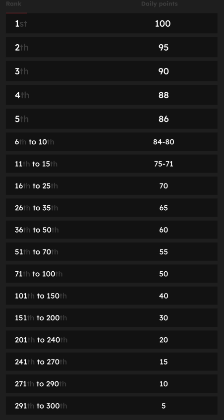

# Classement

<figure><figcaption>
Cela pourrait être vous... 👀
</figcaption></figure>

J'ai publié un tweet, pourquoi mes points ne sont-ils pas mis à jour ?

Nous actualisons les données toutes les 24 heures, donc votre score sera mis à jour en conséquence. Gardez à l'esprit qu'un tweet doit d'abord avoir un certain niveau d'engagement (vues, likes, commentaires, retweets) pour être pris en compte par [LunarCrush](lunarcrush-test.md). Cela peut entraîner un délai pouvant aller jusqu'à 48 heures. Il est important de noter qu'il n'y a pas de limite au nombre de tweets que vous pouvez publier par jour. En tweetant fréquemment et de manière cohérente, les retards de traitement de LunarCrush ont moins d'impact.

Que dois-je faire pour obtenir le plus de points ?

Pour obtenir le plus de points possible pour la saison, l'objectif est de viser la meilleure position dans le classement chaque jour. Faire partie régulièrement des 300 premiers participants forme une base solide, mais atteindre un rang élevé est un exploit qui garantit le maximum de points.

Maintenir une présence régulière est crucial pour ne pas manquer de points quotidiens. Pour optimiser davantage vos points quotidiens, prenez en compte ces bonnes pratiques :

Utilisez le score d'influence de [LunarCrush](lunarcrush-test.md). Maintenez un calendrier de publication régulier (10 à 40 fois par jour pour les influenceurs les plus populaires). Utilisez des $tickers et des #hashtags précis (#XBorg, $XBG et #XBG). Offrez un contenu de valeur pour engager vos followers. Interagissez avec des publications pertinentes, en particulier celles liées aux tokens, aux échanges ou aux NFT qui vous passionnent. Accordez une importance particulière à l'aspect visuel en utilisant des visuels de haute qualité. Mentionnez d'autres personnes influentes et des personnalités notables associées aux tokens sur lesquels vous vous concentrez. Évitez d'utiliser de manière excessive des hashtags non pertinents pour éviter le spam.

Combien de points obtient-on pour un tweet, un like, un commentaire et un retweet ?

Comme nous nous appuyons sur [LunarCrush](lunarcrush-test.md), nous n'attribuons pas de points pour des actions isolées. LunarCrush mesure votre engagement global pour le projet XBorg tout au long de la journée et génère un classement. Sur la base de ce classement quotidien, le joueur accumule des points. Pour plus de détails sur la façon dont le classement d'influence est généré, veuillez vous référer à la [FAQ de LunarCrush](https://lunarcrush.com/faq/how-does-lunarcrush-calculate-social-influence).

Comment les points sont-ils récompensés en fonction de ma portée ?

Les activités d'engagement cumulatif, comprenant des actions telles que les tweets, les likes, les retweets, les commentaires et les followers, jouent un rôle dans la détermination de votre classement quotidien d'influenceur tel que mesuré par LunarCrush. XBorg attribue des points quotidiennement tout au long de la phase en fonction de ce classement. Atteindre un rang plus élevé à la fin de la phase entraîne une récompense plus importante.

Comment puis-je vérifier mes points et mon classement quotidien ?

Rendez-vous sur <mark style="color:red;">**{LIEN VERS LE CLASSEMENT}**</mark>. Le classement est mis à jour toutes les 24 heures.

Comment fonctionne le classement quotidien ?

Sur la base de votre classement, calculé et mesuré sur les 24 dernières heures par LunarCrush, vous obtenez des points sur une base quotidienne.

Les points sont attribués comme suit :

Si votre rang est inférieur à la 300e place, vous ne recevrez pas de points pour cette journée. Mais c'est l'avantage de ce classement : chaque jour vous avez une nouvelle chance de performer.

Nous espérons que cette explication clarifie la manière dont les points sont accumulés.

À quelle fréquence les points et les classements sont-ils mis à jour ?

Nous effectuons une extraction de données quotidiennement et attribuons des points aux 300 meilleurs influenceurs de la journée. Par conséquent, le classement change une fois toutes les 24 heures.

Comment le classement est-il mis à jour ?

Chaque jour, vous gagnez des points en fonction de votre classement quotidien. Ces points sont accumulés quotidiennement pour compiler le classement. Ce classement joue un rôle crucial dans la détermination de vos récompenses à la fin de la phase de qualification ou de la saison.

