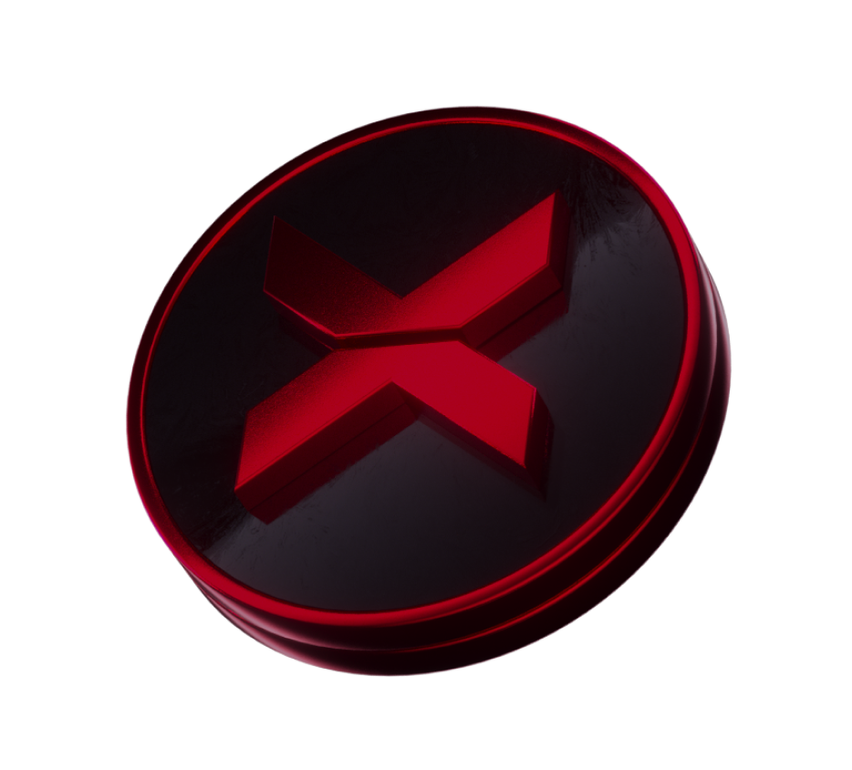

# Ricompense

<figure><figcaption>
Questo è il nostro amato $XBG. Il tuo biglietto per incredibili vantaggi nel gioco.
</figcaption></figure>

Che ricompensa ricevo?

In base al tuo punteggio e agli obiettivi collettivi raggiunti, riceverai una ricompensa individuale in token $XBG, così come una ricompensa collettiva in token $XBG. Tutte le ricompense sono [vincolate](rewards-test.md#per-quanto-tempo-le-ricompense-sono-vincolate).

Per quanto tempo le ricompense sono vincolate?

Come riceverò la mia ricompensa?

Alla conclusione del qualificatore o della stagione, le ricompense verranno inviate al portafoglio che hai fornito, in base al tuo piazzamento finale dopo la fine del concorso. Nota: tutte le ricompense sono [vincolate](rewards-test.md#per-quanto-tempo-le-ricompense-sono-vincolate).

Dove posso fornire il mio portafoglio?

Perché sto ricevendo una ricompensa?

Ti ricompensiamo in segno di apprezzamento per la tua partecipazione attiva e il tuo contributo all'espansione della comunità di XBorg e per la promozione del nostro token $XBG.

Cosa è una ricompensa collettiva?

Una ricompensa collettiva è una dimostrazione del nostro apprezzamento per lo sforzo collettivo dei partecipanti, in cui le ricompense vengono aumentate raggiungendo livelli di traguardo durante la stagione. A seconda del tuo piazzamento finale, riceverai una ricompensa aggiuntiva dal fondo collettivo.

Come verrà suddivisa la ricompensa collettiva? Cosa posso fare per aumentarla?

La suddivisione della ricompensa collettiva è determinata dal tuo piazzamento e può essere aumentata collettivamente raggiungendo traguardi collettivi o completando azioni rapide. Per ulteriori informazioni, consulta le [regole](rules-test.md).

Cosa posso fare per aumentare la mia ricompensa?

Il modo migliore per massimizzare la tua ricompensa è la costanza combinata con la viralità. Maggiore è la tua portata, più alto salirai nella classifica.

Quali sono le ricompense per la prima fase di qualificazione?

Nella prima fase di qualificazione, le ricompense totali ammontano a un massimo di 100.000 XBG, con una parte legata al completamento con successo degli obiettivi collettivi.

Cosa è la zona di ricompensa?

