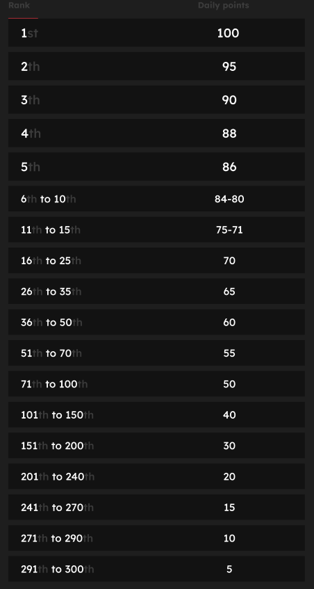

# Classifica

<figure><figcaption>
Potresti essere tu... 👀
</figcaption></figure>

Ho fatto un tweet, perché i miei punti non sono aggiornati?

Aggiorniamo i dati ogni 24 ore, quindi il tuo punteggio verrà aggiornato di conseguenza. Tieni presente che un tweet deve prima avere un certo livello di coinvolgimento (visualizzazioni, mi piace, commenti, retweet) per essere conteggiato da [LunarCrush](lunarcrush.md). Ciò potrebbe comportare un ritardo fino a 48 ore. È importante notare che non c'è limite al numero di tweet che puoi pubblicare in un giorno. Quando tweetti frequentemente e in modo coerente, i ritardi di elaborazione di LunarCrush hanno un impatto minore.

Cosa devo fare per ottenere il massimo dei punti?

Per ottenere il punteggio più alto per la stagione, l'obiettivo è puntare alla posizione più alta nella classifica ogni giorno. Essere costantemente tra i primi 300 partecipanti forma una solida base, ma raggiungere una posizione prominente è un risultato che garantisce il massimo dei punti.

Mantenere una presenza regolare è fondamentale per evitare di perdere punti giornalieri. Per ottimizzare ulteriormente i tuoi punti giornalieri, considera queste buone pratiche:

Utilizza il punteggio di influenza di [LunarCrush](lunarcrush.md). Mantieni un programma di pubblicazione coerente (10-40 volte al giorno per i migliori influencer). Utilizza correttamente i $ticker e gli #hashtag (#XBorg, $XBG e #XBG). Offri contenuti di valore per coinvolgere i tuoi follower. Interagisci con post rilevanti, in particolare quelli legati a token, exchange o NFT di cui sei appassionato. Dai priorità all'aspetto visivo utilizzando immagini di alta qualità. Tagga altre persone influenti e figure importanti associate ai token su cui ti concentri. Evita l'uso eccessivo di hashtag irrilevanti per evitare lo spam.

Quanti punti ottengo per un tweet, un mi piace, un commento e un retweet?

Poiché ci affidiamo a [LunarCrush](lunarcrush.md), non assegniamo punti per azioni isolate. LunarCrush misura il tuo coinvolgimento complessivo nel progetto XBorg durante la giornata e genera una classifica. In base a questa classifica giornaliera, il giocatore accumula punti. Per ulteriori dettagli su come viene generata la classifica di influenza, consulta [FAQ di LunarCrush](https://lunarcrush.com/faq/how-does-lunarcrush-calculate-social-influence).

Come vengono premiati i punti in base alla mia portata?

Le attività di coinvolgimento cumulative, che comprendono azioni come tweet, mi piace, retweet, commenti e follower, giocano un ruolo nel determinare la tua classifica giornaliera di influencer misurata da LunarCrush. XBorg assegna punti su base giornaliera durante la fase in base a questa classifica. Raggiungere una posizione più alta alla fine della fase comporta una ricompensa più consistente.

Come posso controllare i miei punti e la classifica giornaliera?

Visita la nostra [classifica](https://xbg-challenge.xborg.com/). La classifica viene aggiornata ogni 24 ore.

Come funziona la classifica giornaliera?

In base alla tua classifica, calcolata e misurata nelle ultime 24 ore da LunarCrush, ottieni punti su base giornaliera.

I punti vengono assegnati come segue:

Se la tua posizione scende al di là del 300º posto, non riceverai punti per quel giorno. Ma questo è il vantaggio di questa classifica: ogni giorno hai una nuova possibilità di fare bene.

Speriamo che questa spiegazione fornisca chiarezza su come vengono accumulati i punti.

Con quale frequenza vengono aggiornati i punti e le classifiche?

Eseguiamo l'estrazione dei dati ogni giorno e assegnamo punti ai primi 300 influencer della giornata. Di conseguenza, la classifica cambia una volta ogni 24 ore.

Come viene aggiornata la classifica?

Ogni giorno guadagni punti in base alla tua posizione giornaliera. Questi punti vengono accumulati giornalmente per compilare la classifica. Questa classifica svolge un ruolo cruciale nel determinare le tue ricompense alla fine del qualificatore o della stagione.

