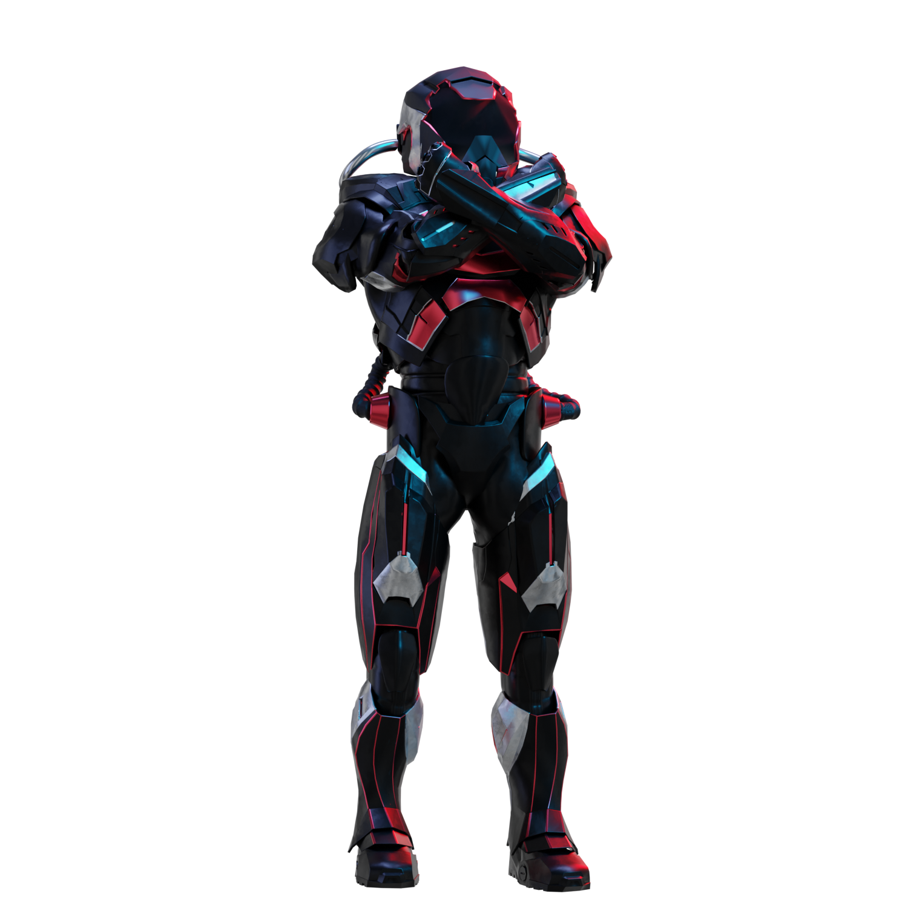

# Regras

<figure><figcaption></figcaption></figure>

Quais são as regras?

Por favor, [role a página para baixo](rules-test.md#rules). Por favor, observe que elas são complementadas pelos Termos e Condições aos quais todo participante concorda.

Posso personalizar meu perfil ou avatar durante o desafio?

Personalizar seu perfil ou avatar no XBorg.gg ou no Twitter durante o jogo não afeta os dados coletados via LunarCrush. Os dados estão vinculados ao seu nome de usuário do Twitter e não à sua imagem de perfil.

Posso colaborar com outros influenciadores em benefício mútuo?

Com certeza, colaborar com outros influenciadores pode aumentar significativamente o engajamento dos seus tweets e ampliar a visibilidade do nosso projeto. Desde que essas colaborações sigam as diretrizes, elas são incentivadas.

Quantos seguidores eu preciso ter para participar?

O desafio está aberto a todos, mas seus pontos só serão contabilizados se você tiver no mínimo 500 seguidores no Twitter.

O que devo evitar ao fazer um tweet?

Vários fatores são levados em consideração para identificar spam: palavras repetidas, hashtags irrelevantes e termos proibidos como "Giveaways", "Airdrops" e "Sweepstakes". Para mais informações, visite: [https://lunarcrush.com/faq/how-does-lunarcrush-recognize-spam](https://lunarcrush.com/faq/how-does-lunarcrush-recognize-spam)

Posso formar equipes ou alianças com outros influenciadores?

Com certeza, colaborar com outros influenciadores pode aumentar significativamente o engajamento dos seus tweets e ampliar a visibilidade do nosso projeto. Desde que essas colaborações sigam as diretrizes, elas são incentivadas.

Há consequências para ações que violam as diretrizes do jogo?

A LunarCrush possui sistemas automatizados para detectar diferentes tipos de conduta inadequada. Ao ser detectado, a LunarCrush não reconhecerá mais você como um influenciador, resultando na interrupção da acumulação de pontos. Se necessário, você também poderá ser desqualificado do concurso, perdendo assim a elegibilidade para reivindicar recompensas.

## **REGRAS**

> **O Desafio XBorg**

**Introdução:** Seja o influenciador mais engajado e influente do XBorg X para ganhar tokens XBG!&#x20;

**Conceito:** \
Todos os dias, as 300 contas com maior engajamento em conteúdos com as hashtags #XBORG, #XBG ou $XBG são rastreadas. Com base em seu desempenho diário, acumulam pontos visíveis em nosso quadro de líderes. No final da temporada, os jogadores receberão suas recompensas com base em suas classificações.&#x20;

**Critérios de Pontuação:** \
Apenas contas do Twitter com mais de 500 seguidores podem acumular pontos. Em conjunto com a LunarCrush, analisamos e classificamos tweets com as hashtags #XBG, #XBorg ou $XBG. Seu sistema garante a integridade do concurso com proteção contra spam e trapaças. Para entender seus critérios, consulte as perguntas frequentes da LunarCrush. Com base na classificação da LunarCrush, pontos são concedidos diariamente de acordo com nossa escala detalhada \[Tabela 1]. As classificações consolidadas podem ser encontradas em {XBorg.com}.&#x20;

**Recompensas:** \
Um orçamento de 100 mil $XBG foi alocado para esta temporada inaugural, dividido entre recompensas individuais (33%) e recompensas coletivas (66%). O cumprimento de metas coletivas desbloqueia recompensas coletivas para todos. Os membros na Zona de Recompensa no final do desafio compartilharão as recompensas com base na escala \[Tabela 2]. Os tokens XBG serão enviados após o TGE (Token Generation Event) e inicialmente ficarão bloqueados por um mês, sendo liberados ao longo de seis meses. Também estão previstas recompensas surpresa, que serão distribuídas a critério da XBorg.&#x20;

**Regras de Jogo Justo:** \
Valorizamos a criatividade, autenticidade e ética. Criamos ferramentas e medidas para identificar comportamentos inadequados. Trapaceiros, assim como usuários de bots, serão identificados e desqualificados. As decisões da XBorg são finais.&#x20;

**Aviso Legal:** \
Cada participante deve ter lido e aceito os termos e condições para participar do Desafio XBorg. A XBorg não se responsabiliza por ações, omissões, problemas técnicos, falhas de servidor, erros, interrupções de serviço, exclusões, defeitos, atrasos de transmissão, roubos, destruições, acesso não autorizado ou alterações relacionadas a terceiros, como LunarCrush, X ou qualquer evento imprevisto que possa prejudicar o funcionamento adequado do concurso.&#x20;

**Direitos de Modificação:** \
Reservamos o direito de alterar os termos e condições do desafio a nosso critério. Embora possamos fazer isso sem aviso prévio, sempre nos esforçaremos para comunicar quaisquer mudanças significativas aos participantes o mais rápido possível.&#x20;

**Limitação de Responsabilidade:** \
Ao participar deste desafio, você concorda em isentar a XBorg de qualquer responsabilidade por perdas, danos ou lesões resultantes direta ou indiretamente de sua participação, incluindo, mas não se limitando a danos causados por vírus de computador ou outros elementos maliciosos obtidos pelo uso do site do concurso ou de qualquer outro site vinculado a ele.