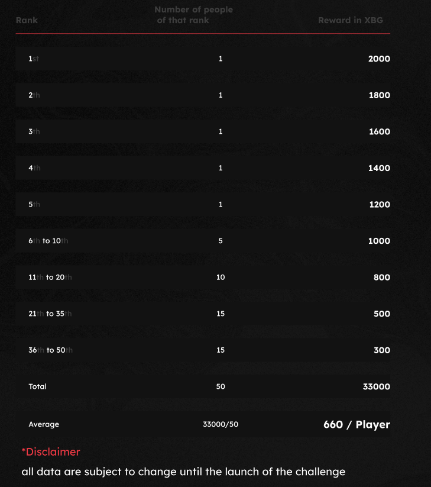

# Recompensas

<figure><figcaption>
Este es nuestro querido $XBG. Tu boleto para increíbles beneficios de juegos.
</figcaption></figure>

¿Qué recompensa obtengo?

Basado en tu total de puntos y los objetivos colectivos alcanzados, recibirás una recompensa individual en tokens $XBG, así como una recompensa colectiva en tokens $XBG. Todas las recompensas están [retenidas](rewards-test.md#¿Cuánto-tiempo-están-retenidas-las-recompensas).

¿Cuánto tiempo están retenidas las recompensas?

¿Cómo recibiré mi recompensa?

Al finalizar la fase de clasificación o la temporada, las recompensas se enviarán a la billetera que proporcionaste, según tu clasificación final después de que el concurso haya terminado. Nota: Todas las recompensas están [retenidas](rewards-test.md#¿Cuánto-tiempo-están-retenidas-las-recompensas).

¿Dónde puedo proporcionar mi billetera?

¿Por qué estoy recibiendo una recompensa?

Te recompensamos en agradecimiento por tu participación activa y contribución a la expansión de la comunidad de XBorg y por promover nuestro token $XBG.

¿Qué es una recompensa colectiva?

Una recompensa colectiva es una demostración de nuestro agradecimiento por el esfuerzo colectivo de los participantes, donde las recompensas se incrementan al alcanzar niveles de hitos durante la temporada. Dependiendo de tu clasificación al final de la temporada, recibirás una recompensa adicional del fondo colectivo.

¿Cómo se dividirá la recompensa colectiva? ¿Qué puedo hacer para aumentarla?

La división de la recompensa colectiva se determina según tu clasificación y puede aumentarse colectivamente al alcanzar hitos colectivos o completar acciones rápidas. Para obtener más información, consulta las [reglas](rules-test.md).

¿Qué puedo hacer para aumentar mi recompensa?

La mejor manera de maximizar tu recompensa es a través de la consistencia combinada con la viralidad. Cuanto mayor sea tu alcance, más alto ascenderás en la clasificación.

¿Cuáles son las recompensas para la primera fase de clasificación?

En la primera fase de clasificación, las recompensas totales suman un máximo de 100k XBG, con una parte vinculada a la finalización exitosa de los objetivos colectivos.

¿Qué es la zona de recompensa?

